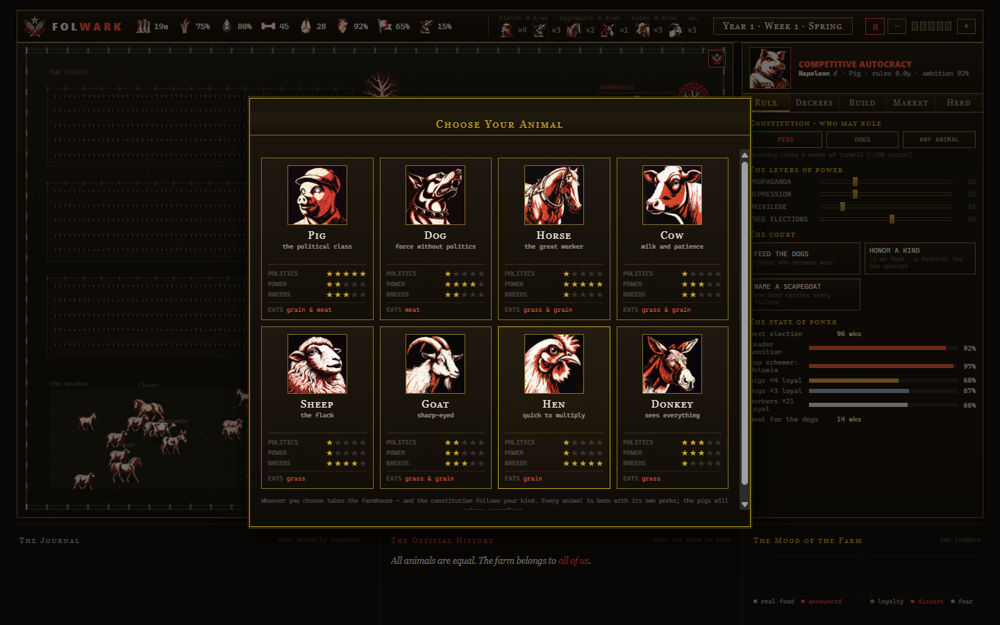

# Aktualna wersja FOLWARK RTS

Gra w katalogu `rts/`: menu startowe, trzy miejsca zapisu, import/eksport JSON, zapamietywane opcje, scenariusz przetrwania, propaganda oraz autonomiczne farmy z produkcja i karawanami. Wschodni trakt laczy region z miastem poza mapa. Szczegoly uruchomienia i zasad w `rts/README.md`.

# FOLWARK

## Grywalna wersja RTS: Przetrwanie i wladza

Projekt z 18 dostarczonymi grafikami znajduje sie w [rts/](rts/README.md).
Po `npm ci` i `npm run portable` w tym katalogu mozna otworzyc `rts/portable/GRAJ-FOLWARK.html` bez serwera i internetu.
Wersja RTS zawiera mape 3600x2400, budowanie drog i 17 rodzajow budowli, kolejki rozkazow, produkcje, badania, potrzeby zwierzat, polityke gospodarcza, wydarzenia i zapisy. Domyslnie dziala scenariusz 10 dni przetrwania: mroz, opal, propaganda, cenzura, przymus i moralne konsekwencje. Trzy sasiednie gospodarstwa lacza drogi i fizyczne karawany. Dawna kampania siedmiodniowa i tryb swobodny pozostaja w Opcjach.

## Oryginalna gra

**A political-systems & ecosystem simulator, after George Orwell.**

### ▶ [Play it now](https://gameowermedia.github.io/FOLWARK/)

The humans are gone. The farm belongs to the animals — and, quietly, to you. You are
the unseen hand: you choose whose kind holds the farmhouse, you pull the levers of
propaganda, repression, privilege and elections, you decide who eats, who builds, and —
when the dogs grow hungry — who becomes the meal.

Two histories are written as you play: **the Journal** (what actually happened) and
**the Official History** (what the farm is told). Only one of them survives you.



## Play

Play in your browser: **https://gameowermedia.github.io/FOLWARK/**

FOLWARK is a single, fully self-contained HTML file. No build step, no dependencies, no
network — all art is inlined as data URIs, so you can also just download `index.html` and
open it:

```
# just open it
start index.html          # Windows
open index.html           # macOS
# ...or serve it
python -m http.server 8199   # then visit http://localhost:8199
```

## What it is

A Paradox-style grand-strategy toy modelling how a small society tips from revolution
into hierarchy. Every animal is an individual with its own traits and **randomly-generated
perks** rolled at birth (breed-appropriate for the founding stock).

- **Four linked resources** — grain, grass, meat and water — with seasonal regeneration
  and per-species metabolism. Overgraze the meadow and the hay comes out of the granary;
  drink the waterhole dry in summer and thirst spreads.
- **A constitution** deciding which species may rule (pigs / dogs / any), amendable at the
  cost of constitutional turmoil.
- **The levers of power** — propaganda, repression, privilege, free elections — as sliders.
- **The Court** — feed the dogs, honor a kind, or name a scapegoat; when meat runs low the
  leader must choose who becomes the meal.
- **Species that don't overlap** — pigs scheme and form councils, dogs are force that
  can't govern, horses are the great workers, hens are dim but multiply fast. Each has its
  own stat ranges, real-world lifespans (in weeks), diet and breeding rate.
- **Dilemmas, decrees, construction and a market**, elections, coups, purges and
  revolutions — and a chronicle written in propaganda that you inherit when you lose.

## Choosing your animal

Whoever you choose takes the farmhouse, and the constitution follows your kind. Each
species is rated across **Politics**, **Power** and **Breeds**, shows what it eats (only
resources the farm can actually produce), and — because every animal is individual — you
meet your leader's own perks the moment you click their portrait.

## Credits

Thematic debt to George Orwell's *Animal Farm* (1945). Art generated in a
linocut / constructivist style and baked into the page. Built as an experiment in
browser-based political simulation.

## License

MIT — see [LICENSE](LICENSE).
